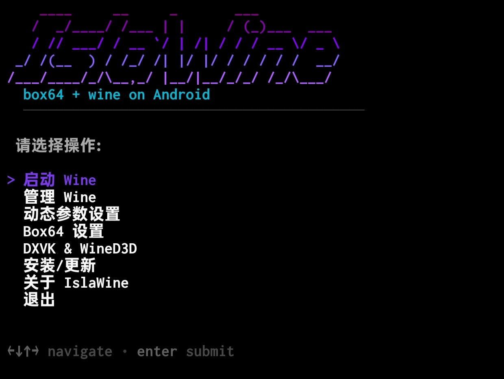
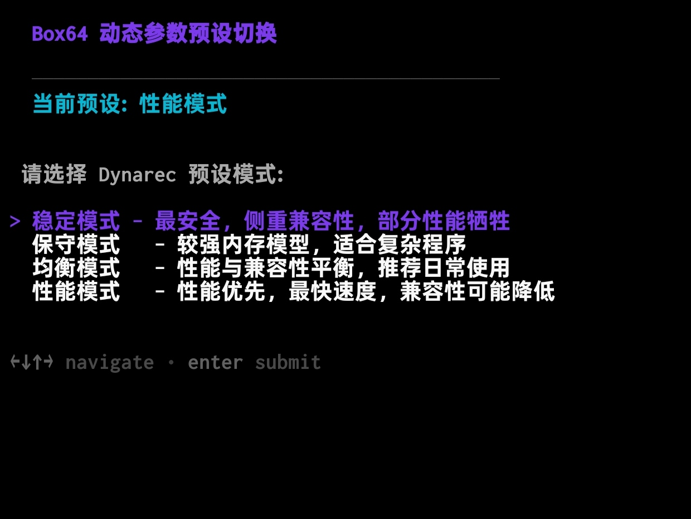
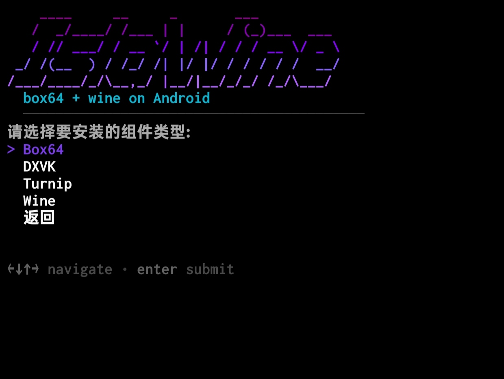

<table width="100%" style="border-collapse: collapse;">
  <tr>
    <td width="180" align="left" style="padding: 20px 10px 20px 0;">
      
    </td>
    <td style="padding: 20px 0 20px 10px;">
      <h1>🍷 IslaWine</h1>
      
<strong>用于在Termux中使用Wine + Box64/FEX 运行Windows程序的TUI项目</strong>

      

        
        
        
      

    </td>
  </tr>
</table>

# 介绍
- 本项目是运行在Termux终端上的TUI系统，主要由shell脚本组成，目的是提供一个在Android设备上快捷启动Windows程序的平台
- 你可以轻松的使用此项目提供的TUI系统管理运行Windows程序时所需的所有组件，例如Wine、DXVK、Turnip、Box64等
- 项目会持续更新，不定时上传各种组件的最新稳定版或是测试版，可直接在系统选项中更新
> 项目背景：灵感来源于[Mobox](https://github.com/olegos2/mobox)和[Winlator](https://github.com/brunodev85/winlator)等项目
>
> 本项目由我本人兴趣开发、更新与维护，如果在使用中遇到问题请在issue中提供bug反馈，非常感谢！

<table align="center">
  <tr>
    <td align="center"></td>
    <td align="center"></td>
    <td align="center"></td>
  </tr>
</table>

# 安装

    项目仍在开发中，当前已立项的仓库主要用于测试在线更新功能

# 鸣谢
> 感谢此项目中使用到的所有项目以及他们的开发者！

- Termux-App ([termux/termux-app](https://github.com/termux/termux-app))
- Glibc-Packages ([termux-pacman/glibc-packages](https://github.com/termux-pacman/glibc-packages))
- Termux-X11 ([termux/termux-x11](https://github.com/termux/termux-x11))
- WineHQ ([www.winehq.org](https://www.winehq.org/))
- Mesa3D ([mesa3d.org](https://mesa3d.org/))
- DXVK ([doitsujin/dxvk](https://github.com/doitsujin/dxvk))
- Box64 ([ptitSeb/box64](https://github.com/ptitSeb/box64))
- Hangover ([AndreRH/hangover](https://github.com/AndreRH/hangover))
- FEX ([FEX-Emu/FEX](https://github.com/FEX-Emu/FEX))
